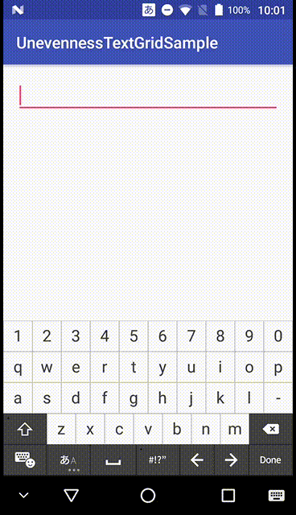

# UnevennessTextGridSample

## What is this?

## Author
大前 良介 (OHMAE Ryosuke)
http://www.mm2d.net/

## License
[MIT License](./LICENSE)

Sample dictionary data is based on cannadic of anthy.
https://ja.osdn.net/projects/anthy/
